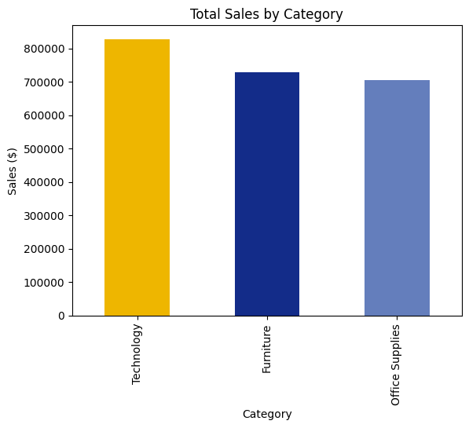
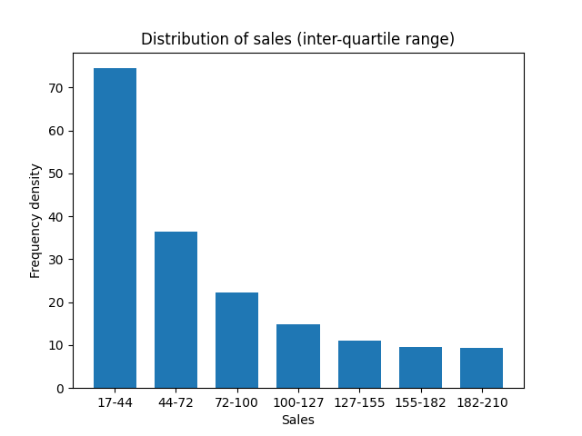

# Superstore-Data-Analysis
## Overview
This is my first solo data project which looks into the sales of a superstore in the USA. Behind the scenes, I set up an environment for data analysis so that I could use SQL. The analysis is fairly basic, just to get me used to SQL and use my experience of Python. The dataset is from Kaggle: https://www.kaggle.com/datasets/rohitsahoo/sales-forecasting

## Objectives
The following quetions are answered in this analysis:
<ol>
    <li>Which category had the highest sales?</li>
    <li>Which state had the fewest customers?</li>
    <li>Which months performed best?</li>
    <li>Which customers had spent the most? (Who are the most valuable?)</li>
    <li>How are the sales distributed?</li>
</ol>

## SQL Analysis
Questions 1-4 were all answered from SQL queries, which can all be found in the notebook. The following insights were found:
<ol>
    <li>The category with the HIGHEST sales was TECHNOLOGY.</li>
    <li>WYOMING was the state with the FEWEST customers.</li>
    <li>MARCH and JANUARY were the BEST performing months.</li>
    <li>The MOST VALUABLE customer was SEAN MILLER (by sales).</li>
</ol>

## Python + Visualisations
Questions 1 and 5 were answered in Python with visualisations. These were the key insights:
<ul>
    <li>The categories from WORST to BEST, by sales, were TECHNOLOGY, FURNITURE and then OFFICE SUPPLIES (see Figure 1).</li>
    <li>The range in sales was very LARGE (approximately $22.6K) and the inter-quartile range was only $193.36!</li>
    <li>The mean sales was $230.77 and the median was far LESS at just $54.49 which is an indication of SKEW. The standard deviation was $628.65.</li>
    <li>The distribution of sales was in fact POSITIVELY SKEWED, peaking within the interval $17—44 (see Figure 2).</li>
</ul>

     
    Figure 1: Sales by category

     
    Figure 2: Distribution of sales

## AI Involvement
AI was used to guide me through the processes of setting up an appropriate environment for data analysis, as well as getting started with GitHub. It was also used to help with becoming more familiar with SQL and the Pandas module for Python.

## Limitations
This project some basic skills, however there are a few limitations with the selected dataset:
<ul>
    <li>The data was unrealistically clean from the start, so I haven't been able to demonstrate data-cleaning skills.</li>
    <li>The only fully numerical column in the data was Sales, so I haven't been able to show complex mathematical skills and find insightful correlations.</li>
</ul>

## Next Steps
If I ever continue this small project or if I did this again, I could possibly fit a curve to the sales distribution and find a probability density function. Also, it would be interesting to forecast future sales, possibly using the distribution and Monte Carlo simulation.
